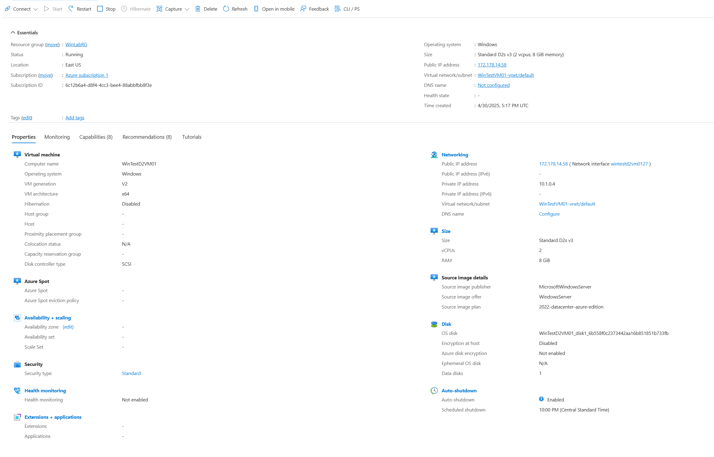
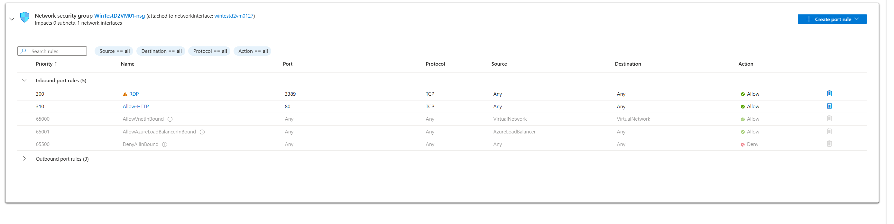
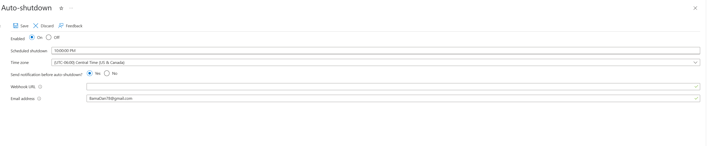
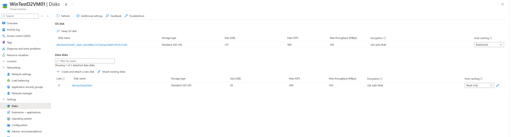
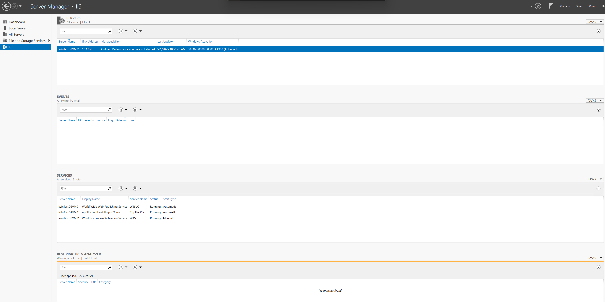
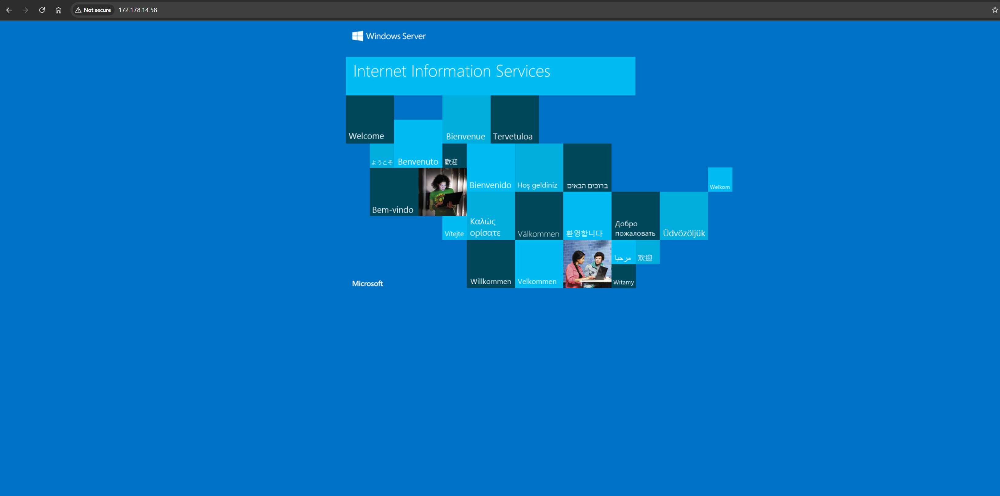
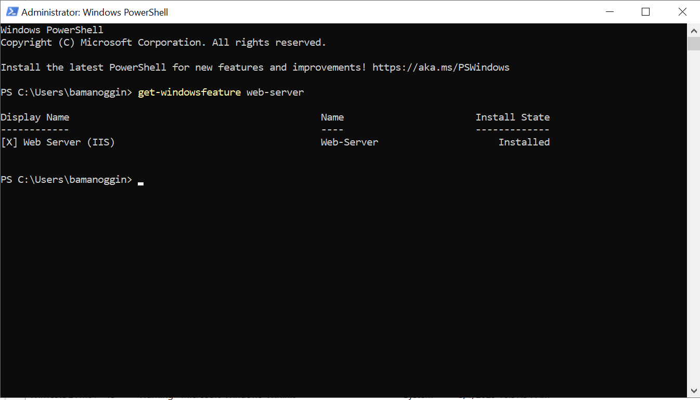
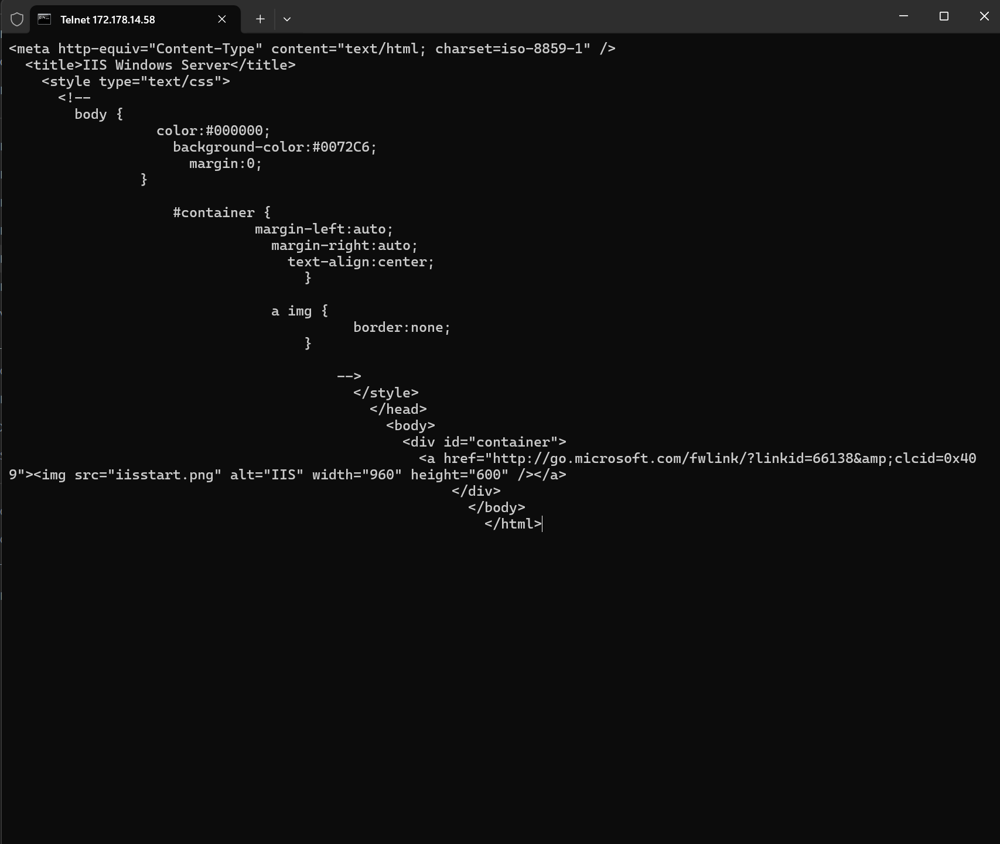
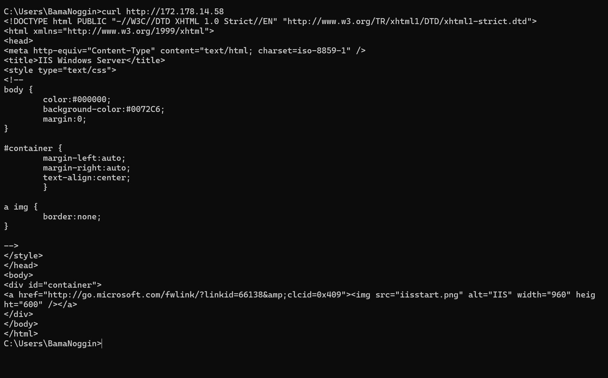

# Project: Hosting an IIS Web Server on an Azure VM

## 🧭 Overview

In this project, I deployed a Windows Server 2022 VM in Microsoft Azure, installed IIS, configured the appropriate Network Security Group (NSG) rules, and verified access to the web server using both Telnet and curl. This project reinforced core Azure VM management, networking, and basic web hosting fundamentals.

---

## 🔧 Tools & Services Used

- Azure Portal
- Windows Server 2022 Datacenter (D2s_v3)
- IIS (Web Server role)
- Azure NSG rules
- PowerShell & Command Prompt
- Telnet
- curl

---

## 🪜 Key Steps

1. Created a new Windows Server VM using the Azure Portal
2. Installed IIS via Server Manager
3. Opened TCP port 80 using Azure NSG inbound rule
4. Verified local web service using `http://localhost`
5. Confirmed external connectivity with:
   - `telnet <public-IP> 80`
   - Manual `GET / HTTP/1.1` request
   - `curl http://<public-IP>` from a second system

---

## 📸 Screenshots

### Azure Configuration

- **VM Overview**  
  

- **NSG Inbound Rule for Port 80**  
  

- **Auto-Shutdown Configuration**  
  

- **Attached Data Disk**  
  

---

### Windows Server Environment

- **IIS Role Installed in Server Manager**  
  

- **IIS Default Page in Browser**  
  

- **Role Confirmation via PowerShell (`Get-WindowsFeature`)**  
  

---

### Web Server Connectivity Tests

- **Telnet Session with Raw HTTP GET Response**  
  

- **curl Response Confirming Web Server Reachability**  
  

---

## 💡 What I Learned

- How Azure's NSG rules interact with Windows Defender Firewall
- How to use Telnet and curl to manually validate web server availability
- Basics of serving content from IIS and understanding HTTP headers

---

## 🚀 Next Steps

- Add a custom HTML page to the IIS root
- Enable HTTPS with a self-signed certificate
- Deploy a similar setup using automation (PowerShell or ARM templates)

