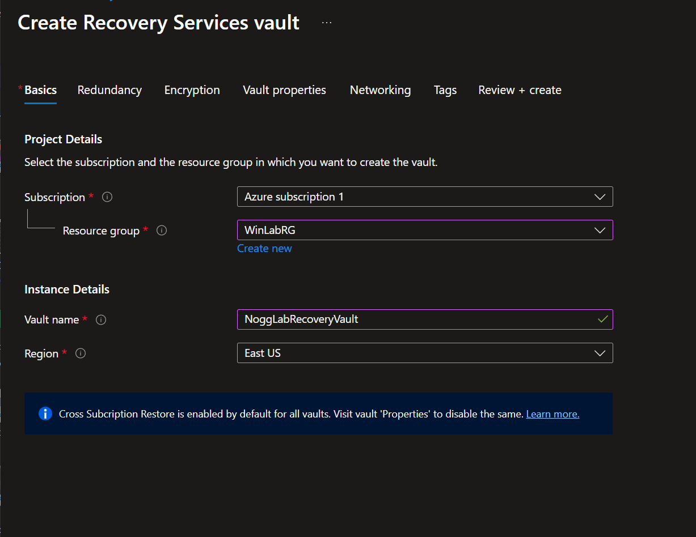
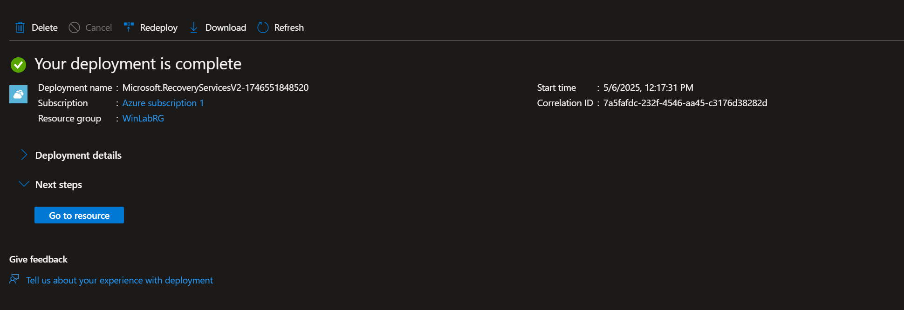
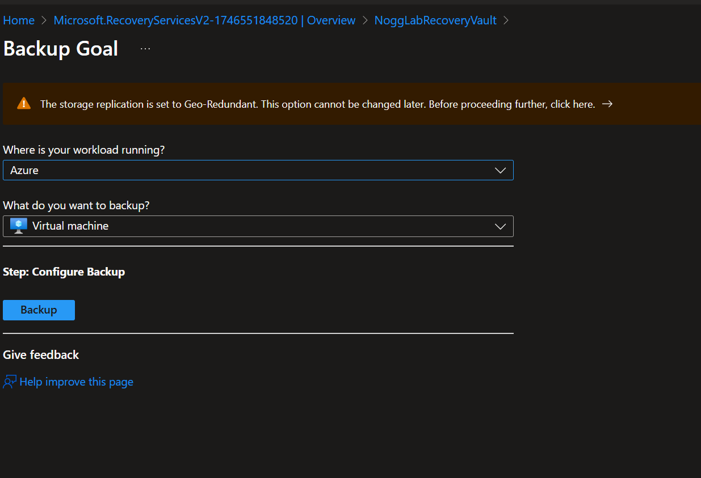
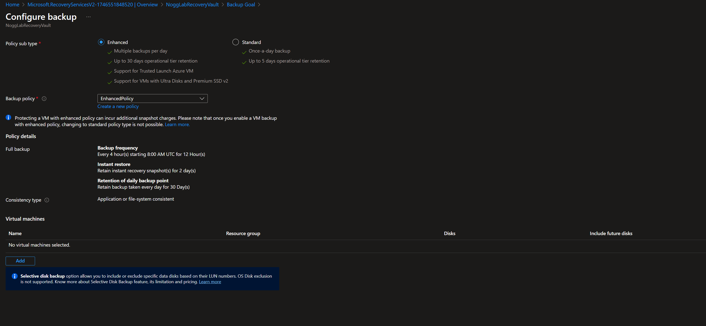
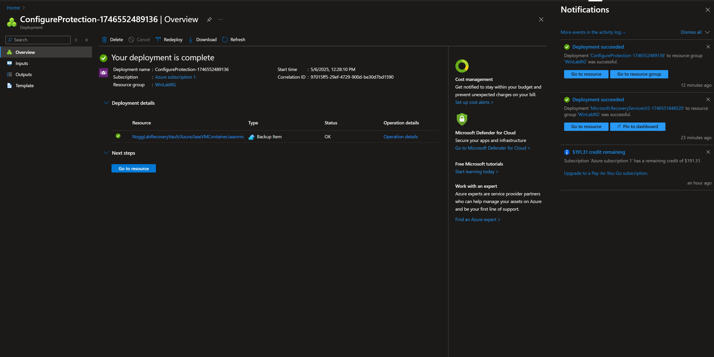
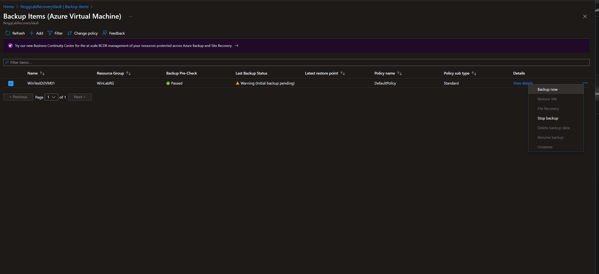
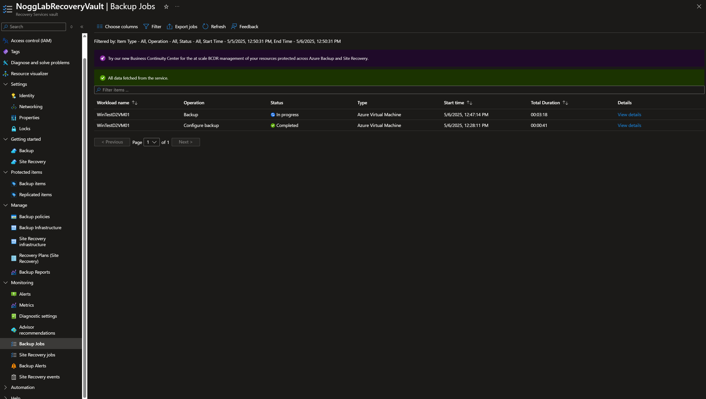
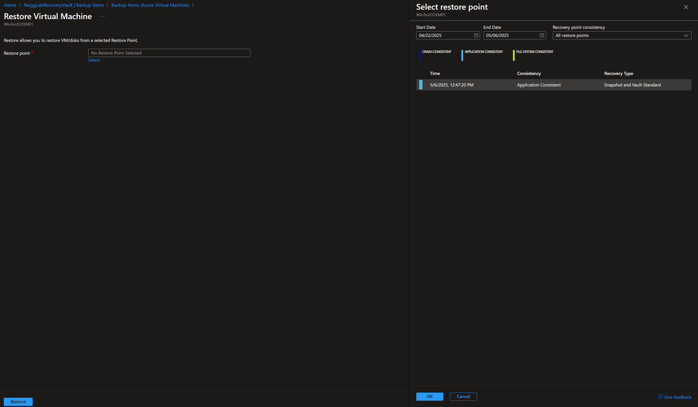

# Azure VM Backup and Disaster Recovery Lab

## Overview

This lab demonstrates how to configure Azure Backup for a Windows Server VM acting as an Active Directory Domain Controller (AD/DC). The goal was to implement a basic disaster recovery strategy using Azure Recovery Services Vault and simulate the restore process.

---

## ✅ Lab Tasks Completed

1. Created Recovery Services Vault (`NoggLabRecoveryVault`)
2. Enabled backup for `WinTestD2VM01` (Windows Server Domain Controller)
3. Applied a Standard Backup Policy with 30-day retention
4. Initiated a manual backup
5. Verified backup status via the Backup Jobs page
6. Simulated a VM restore preview using the most recent restore point

---

## 📸 Key Screenshots

| Description | Screenshot |
|-------------|------------|
| Vault creation config |  |
| Successful deployment of vault |  |
| Backup goal setup |  |
| Backup policy settings and VM selection |  |
| Confirmation of backup being linked |  |
| Manual backup initiated |  |
| Backup job in progress |  |
| Restore point options preview |  |

---

## 🧠 Concepts Demonstrated

- Azure Backup architecture and vault setup
- Standard vs Enhanced policies
- Application-consistent restore points
- Safe, non-disruptive restore simulation
- Real-world relevance for enterprise disaster recovery

---

## 🧰 Tools Used

- Azure Portal
- Azure Recovery Services Vault
- Windows Server 2022 VM (AD/DC)
- GitHub for lab documentation

---

## 🔒 Why This Matters

Backing up Active Directory domain controllers ensures minimal downtime and protects identity infrastructure. Azure's incremental backup system offers secure, cost-effective disaster recovery—even for small environments like this lab.

---

## 🚀 Next Steps (Future Labs)

- Enable file-level restore testing
- Automate backup alerts and monitoring
- Explore on-premises PC backup using MARS agent
