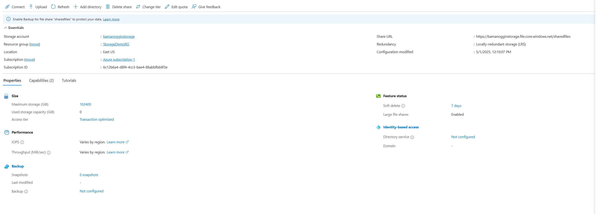
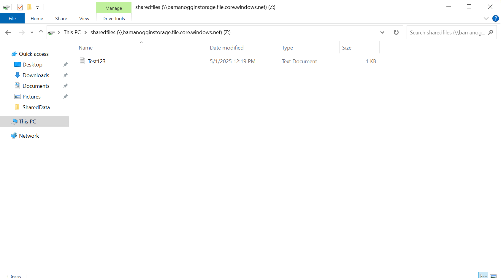
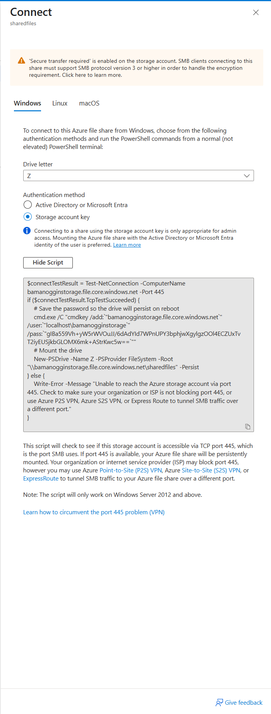
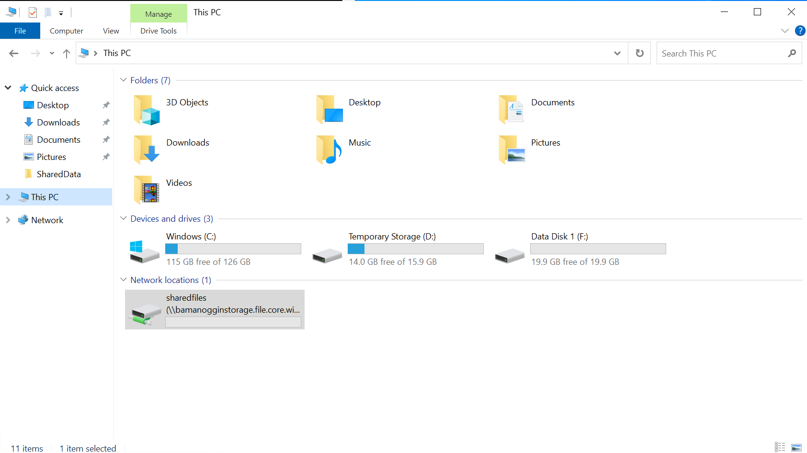
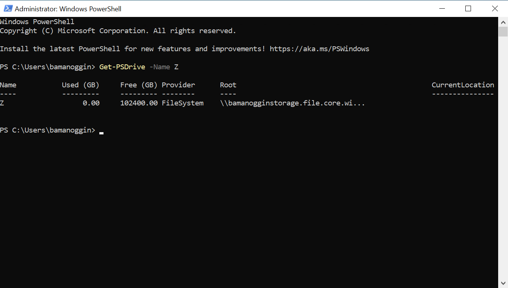

# Project: Azure File Share with Windows Server

## 🧭 Overview

This project demonstrates how to create and mount an Azure File Share using SMB protocol in a Windows Server VM. It mirrors traditional on-prem file sharing but uses Azure cloud-based storage instead of a physical file server.

---

## 🔧 Tools & Services Used

- Azure Portal
- Azure Storage Account
- Azure File Shares (SMB)
- PowerShell (`New-PSDrive`)
- Windows Server 2022 (D2s_v3)

---

## 🪜 Key Steps

1. Created an Azure Storage Account with LRS redundancy
2. Added a new file share (`sharedfiles`)
3. Used the Azure-provided PowerShell script to mount the share
4. Verified access by creating and editing a test file on the new drive

---

## 📸 Screenshots

### Azure Configuration

- **Storage Account & File Share Overview**  
  

- **File Share Created**  
  

- **Connection Panel with PowerShell Script**  
  

---

### Windows Server (Mapped Drive)

- **Mapped Drive Visible in File Explorer**  
  

- **PowerShell Drive Mounted (`Z:`)**  
  

---

## 💡 What I Learned

- Azure File Shares provide a cloud-native way to store and access files using familiar SMB protocols
- Authentication via storage account key is easy to set up but should be protected like a password
- Azure storage integrates smoothly with on-prem and VM environments using UNC paths and PowerShell

---

## 🚀 Next Steps

- Explore access via Azure AD DS or identity-based authentication
- Set up a backup solution for this file share
- Compare performance between locally hosted SMB and Azure Files

